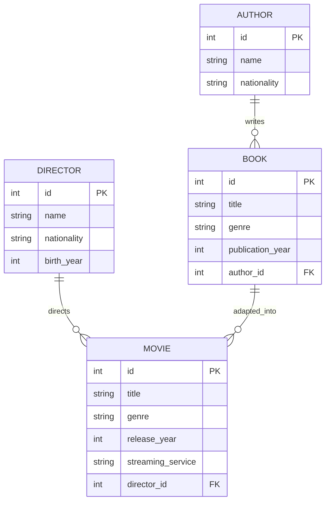

# Database Diagram

```mermaid
erDiagram
    AUTHOR ||--o{ BOOK : writes
    DIRECTOR ||--o{ MOVIE : directs

    AUTHOR {
        int id PK
        string name
        string nationality
    }

    BOOK {
        int id PK
        string title
        string genre
        int publication_year
        int author_id FK
    }

    BOOK ||--o{ MOVIE : adapted_into

    DIRECTOR {
        int id PK
        string name
        string nationality
        int birth_year
    }

    MOVIE {
        int id PK
        string title
        string genre
        int release_year
        string streaming_service
        int director_id FK
    }
```
