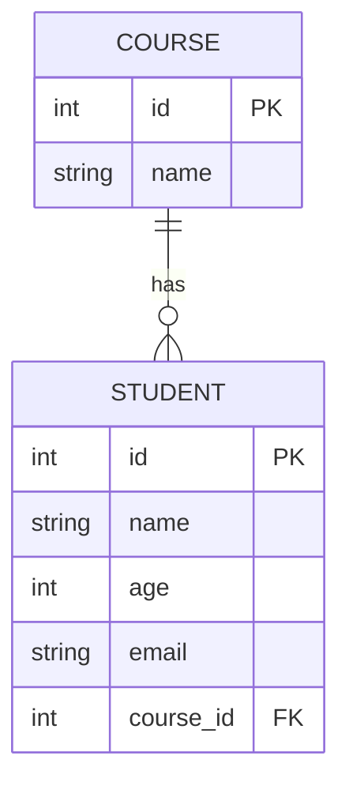

# Database Diagram

```mermaid
erDiagram
    COURSE ||--o{ STUDENT : has

    COURSE {
        int id PK
        string name
    }

    STUDENT {
        int id PK
        string name
        int age
        string email
        int course_id FK
    }
```
