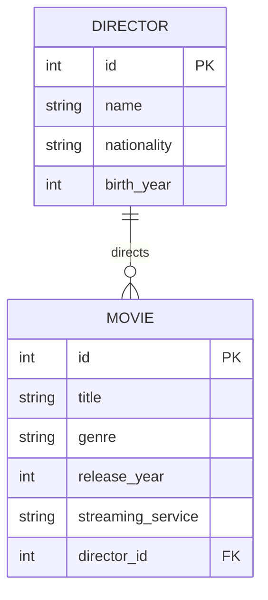

# Movie Streaming Catalog

A Django app with two related tables:
- Director
- Movie

## Database diagram



## Run locally

```bash
cd /home/wahome/Glo/db
. .venv/bin/activate
python manage.py runserver 0.0.0.0:8080
```

Open http://127.0.0.1:8080/catalog/
